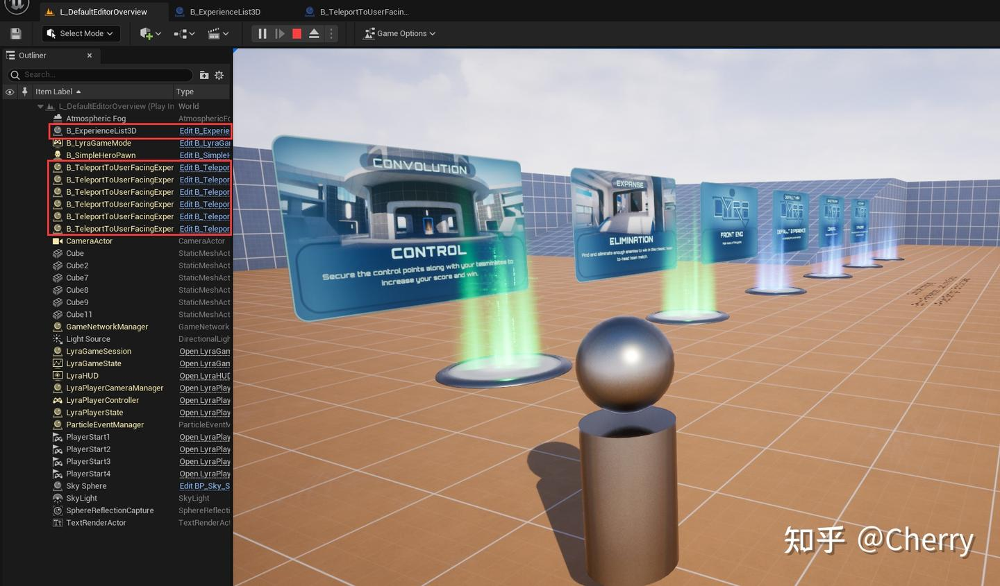

# Lyra项目个人笔记

## 1.地图加载流程

[参考来源：知乎Cherry](https://zhuanlan.zhihu.com/p/563434530 "地图加载解析")

进入项目后，点击Play in Editor，我们会进入到默认地图中。

---


加载流程如下：

* 从ALyraGameMode：：InitGame开始，代码如下

```
void ALyraGameMode::InitGame(const FString& MapName, const FString& Options, FString& ErrorMessage)
{
	Super::InitGame(MapName, Options, ErrorMessage);

	// Wait for the next frame to give time to initialize startup settings
	GetWorld()->GetTimerManager().SetTimerForNextTick(this, &ThisClass::HandleMatchAssignmentIfNotExpectingOne);
}
```

* 可以看到这里游戏逻辑在下一帧被转发到了ALyraGameMode::HandleMatchAssignmentIfNotExpectingOne中，它按照优先级顺序确定玩家将进入的Experience类型(Experience的加载流程后续再看)
* 注：Experience定义了玩家在游戏中参与特定玩法或模式时所涉及的各种配置和规则，可理解为一种综合性的游戏模式设定集

| 优先级顺序（高到低） |
| -------------------- |
| 匹配服务器分配       |
| URL参数              |
| 开发者设置           |
| 命令行参数           |
| 世界设置             |
| 专用服务器逻辑       |
| 默认Exprience        |

* 加载完Experience之后，我们可以看到一个简单小人被创建在地图中央了

  
* 可以看到在L_DefaultEditorOverview中，放置了一个B_ExperienceList3D的Actor，它负责加载出游戏中所有属于LyraUserFacingExperienceDefinition的Primary Asset。
* 注：`ULyraExperienceDefinition` 类用于定义 Experience，它是一个 `PrimaryAsset`（主资源）
* `B_TeleportToUserFacingExperience`就是场景中的一个个关卡传送器

  接下来我们移动小人，走到传送门前，就会触发地图切换的流程了

  ---

  ## 地图切换流程
*
